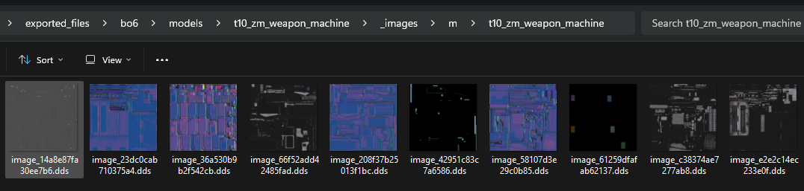

# Material Layers Mapping

!!! note ""
    This tutorial is edited from **Kingslayer Kyle**, and it applies to:

    - BO6
    - BO7

## Requirements
- Models must be exported in the **Cast** model format.
- [BO6Tools (Maya Plugin)](https://github.com/KingslayerKyle/BO6ToolsMayaPlugin)
- [Cast (Maya Plugin)](https://github.com/dtzxporter/cast/releases)

## Why This Plugin Is Needed
In recent Call of Duty titles, ^^vertex colors are used to define image placements within materials^^. For example, a single material can contain multiple images, such as several `CS` and `NOG` textures, all within the same material folder. Some games and tools, like BO3 Mod Tools doesn't support this feature, which is where this plugin comes in.

!!! tip ""
    The plugin only performs model segmentation by color layers; you still need to manually set the UV layer index for the model processed wherever it is used.



## Installation
1. Download `BO6Tools.py` from the `BO6ToolsMayaPlugin` repository.

2. Place it in your Maya scripts folder:
    `Documents/maya/<version>/scripts`

3. Edit `userSetup.mel` in the same folder and add the following line at the end:
    ```mel
    python("import BO6Tools");
    ```

4. Save the mel file.

## Using the Plugin
1. Import your Cast model (e.g., `t10_zm_weapon_machine`).
    

2. In the toolbar above the scene window, set the renderer to **Legacy High Quality Viewport**.

3. In the **menu bar**, go to:  
    `Mesh Display > Color Set Editor`

4. In the **Color Set Editor**, enable:  
    `Display > All > Color In Shaded Display On`

5. You should now see vertex colors displayed on the model.

6. Select the mesh that you want to fix.

7. With the mesh selected, click **BO6 Tools** in the menu bar and choose **Separate Selected Mesh**.
    - If your model uses **red, green, and blue**, use the top option to separate all colors.
    - Otherwise, use the second option to separate only the colors present on your model.
    

8. The vertex colors are now split into separate meshes with their own materials. Your model is ready for standard material setups in BO3 Mod Tools.
    

## Credits
    dest1yo
    echo000
    Kingslayer Kyle
    Scobalula
    DTZxPorter
